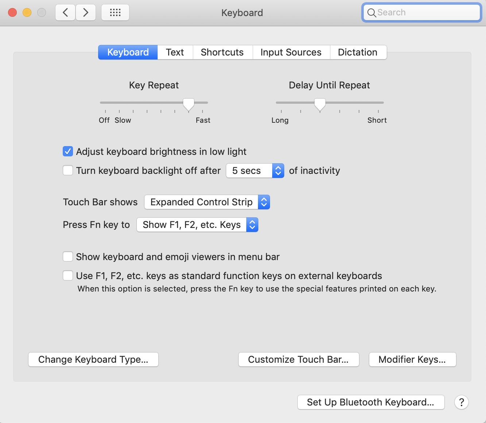
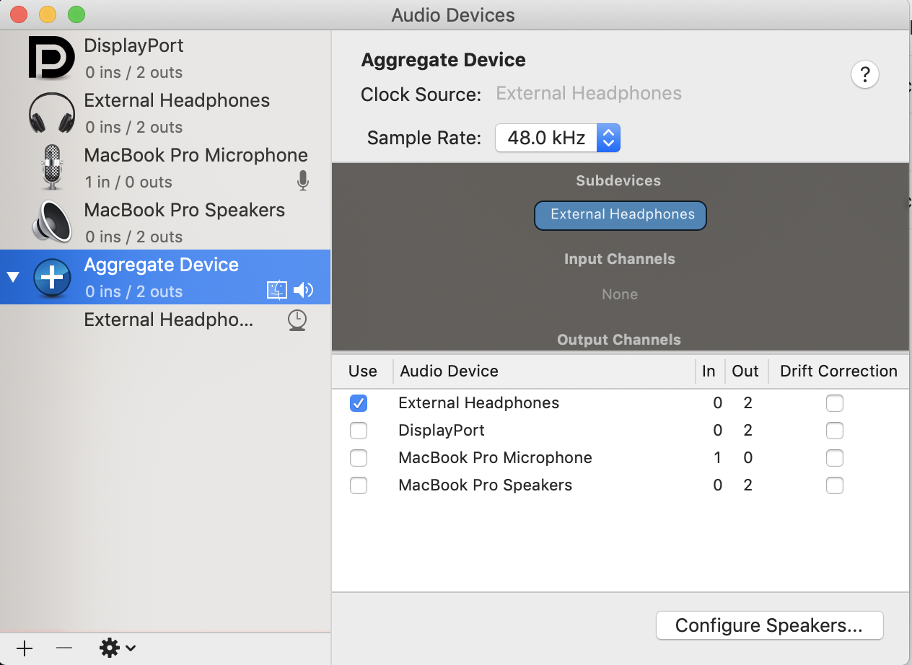

# dotfiles

git clone https://github.com/sfahlberg/dotfiles.git

bash setup_dotfiles.sh

now, download iterm

on mac store ssh code in keychain
```
cp ~/dotfiles/config ~/.ssh/
```

download karabiner(https://pqrs.org/osx/karabiner/)
store config for karabiner
```
cp ~/dotfiles/karabiner.json ~/.config/karabiner
```

### setup touchbar



### setup headphones so music doesn't play when you plug and unplug


