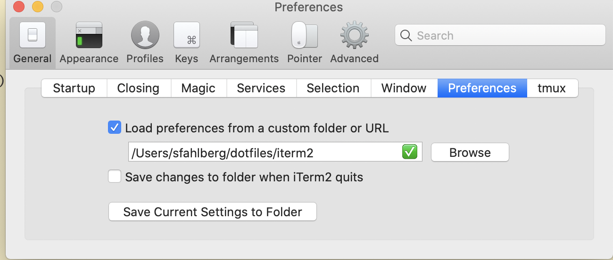

### setup  github

* [Generate a new SSH key and add it to the ssh-agent](https://help.github.com/en/articles/generating-a-new-ssh-key-and-adding-it-to-the-ssh-agent#generating-a-new-ssh-key)
* [Add your SSH key to your github account](https://help.github.com/en/articles/adding-a-new-ssh-key-to-your-github-account)
* [Enable SSO for your SSH keys ](https://help.github.com/en/articles/authorizing-an-ssh-key-for-use-with-a-saml-single-sign-on-organization)
* [Setup homebrew](https://brew.sh/)

### setup dotfiles

in terminal:
```
git clone git@github.com:sfahlberg/dotfiles.git # not https
bash setup_dotfiles.sh
```

### setup iterm config

now, [download](https://www.iterm2.com/downloads.html) iterm



### setup vim

open vim
run `:PlugInstall`

### karabiner

download karabiner(https://pqrs.org/osx/karabiner/)
store config for karabiner
```
cp ~/dotfiles/karabiner.json ~/.config/karabiner
```
### setup touchbar


